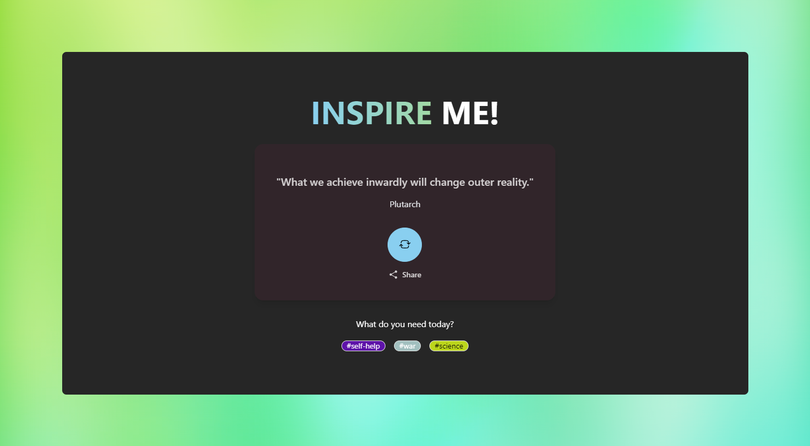

# Quote Me

Welcome to [Quote Me](https://quote-me-nc.netlify.app/) - the inspirational quote generator that sparks positivity with a single click!

## Description

Whether you're looking for a daily dose of motivation or a powerful statement to share with friends, Quote Me delivers thought-provoking words to uplift your spirit and challenge your perspective.

## Features

-   Generates inspirational quotes with a single click
-   Provides daily motivation
-   Allows sharing of quotes with friends

## Installation

1. Clone the repository
2. Run `npm install` to install dependencies
3. Run `npm start` to start the app

## Usage

1. Click the "Generate Quote" button to get a new inspirational quote
2. Share the quote with friends by clicking the share button

## Contributing

If you have any suggestions for how to improve the app, please submit a pull request with your proposed changes.

## License

This project is licensed under the MIT License - see the LICENSE.md file for details.

## Credits

-   Created by [Nathaniel Campbell](https://github.com/Nathan1434)
-   Inspirational quotes provided by [Quotable](https://github.com/lukePeavey/quotable)
